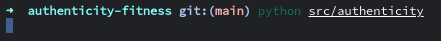

# AUTHENTICITY FITNESS

> ### Authencity
> - the quality of being authentic.

> ### Fitness
> - the condition of being physically fit and healthy.

The ultimate goal for this project is the creation of an application to track my workouts. It has the secondary purpose of serving as an information database for exercises.

Currently, one part of this program is functional: the exercise database.

The exercise information within the database is borrowed from [API Ninjas](https://www.api-ninjas.com), using their exercise API.

## Requirements

Authenticity Fitness requires the following python library.

* [customtkinter](https://github.com/TomSchimansky/CustomTkinter)

## Usage

